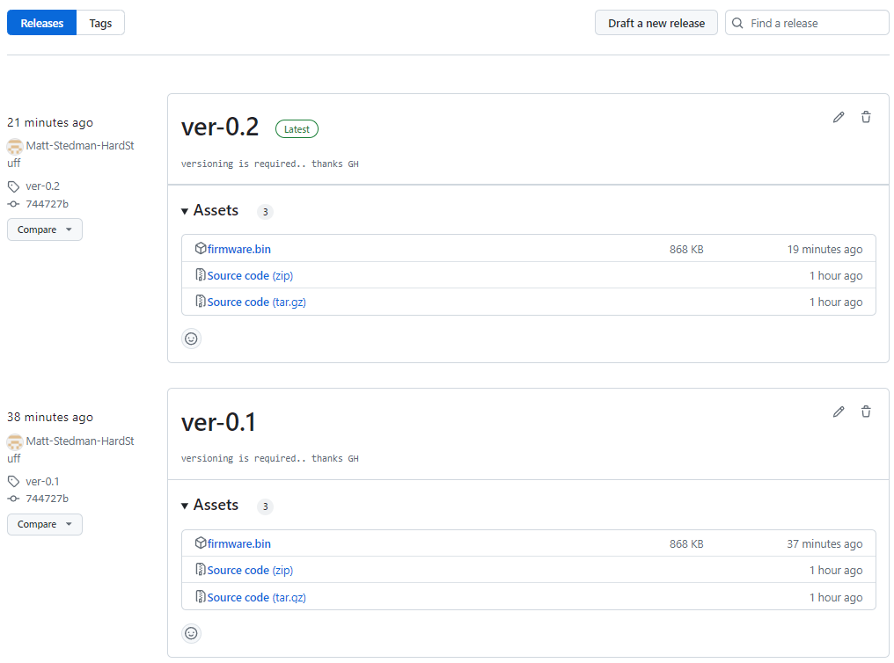
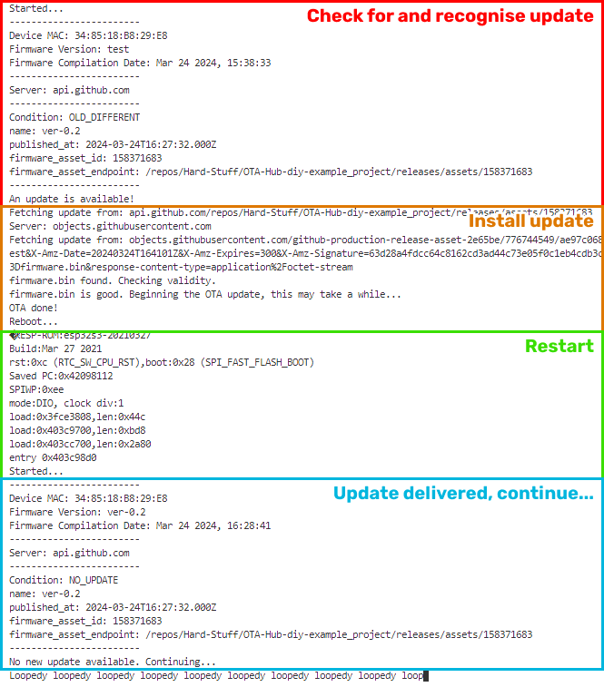

# OTA Hub (by Hard Stuff) - OTA directly from GitHub, Example

This example project gets you set up with OTA Hub DIY, ready for Over-The-Air updates driven directly from your GitHub repo's releases, all for free.

**OTA Hub** is designed to do one thing, and one thing only:

    Deliver Over-the-Air updates onto your ESP32/embedded devices directly from your code releases in an obvious, clean, light-weight way.

**OTA Hub DIY** (this example) is for the hobbyists and small teams, directly grabbing release files from GitHub, involving as minimal setup as possible. It's completely open-source, and of course, free!

**OTA Hub Pro** is for the experts and larger teams, providing you with a dashboard to have finer control over your release deployment, fleet management, greater flexibility, and even less setup! Find out more at [otahub.wordpress.com/](https://otahub.wordpress.com/).

### Benefits over alternatives

1. No-longer worry about drag-and-dropping `.bin` files into some fiddly UI.
2. Easily trace your code to your releases to your deployed firmware.
3. Not locked into any eco-systems you probably aren't using already (you're probably already using GitHub).
4. Client-agnostic! Implement OTA Hub on-top of secure or insecure\* connections, on 4G, NB-IoT, or WiFi modules.
5. The DIY version is open-source, **completely free**, and GitHub hosting is also (currently) completely free!

_\* Note that our default examples are for SSL-enabled connections, as GitHub requires a secure connection. As this is open-source, you can of course use your own storage buckets APIs for insecure connections etc._

## Steps

There are only two steps you need to consider for OTA updates from GitHub:

1. Set up the CI/CD on your GitHub repo to automatically build the firmware on new releases. This is as easy as copying the [.github/workflows/](.github/workflows/) project into your PlatformIO base directory (like in this example). Then, build new releases as normal.    
   

2. Include the [OTA-Hub library](https://registry.platformio.org/libraries/hard-stuff/OTA-Hub-diy-device_client) and example code you'll find in [src/main.cpp](src/main.cpp). Note the `#define`s, and the inclusion of `OTA::isUpdateAvailable()`, `OTA::performUpdate(..)`, and `OTA::followRedirect(..)`.    
   

That's it!

### Dependencies

-   hard-stuff/OTA-Hub-diy-device_client

## Compabibility and testing

OTA Hub DIY works with both your public and private repositories, pulling release files (that are automatically compiled) directly from GitHub. If using a private repository, you will need `#define OTA_BEARER "your_token"`, [learn more here](https://docs.github.com/en/authentication/keeping-your-account-and-data-secure/managing-your-personal-access-tokens).

This library has been tested on the ESP32S3 with both the internal WiFi functionality and a [SIMCOM SIM7600G](https://github.com/Hard-Stuff/TinyGSM).

We are looking for people to support us in testing more boards, other connectivity functionalities, and making **OTA Hub Pro** even more useful. Contribute either on our GitHub repos, or contact us at [ota-hub@hard-stuff.com](mailto:ota-hub@hard-stuff.com).

## Hard Stuff

Hard Stuff is a hardware prototyping agency and venture studio focussing on sustainability tech, based in London, UK.
Find out more at [hard-stuff.com](hard-stuff.com).

This library is written and provided open-source in the hope that you go on to build great things.
